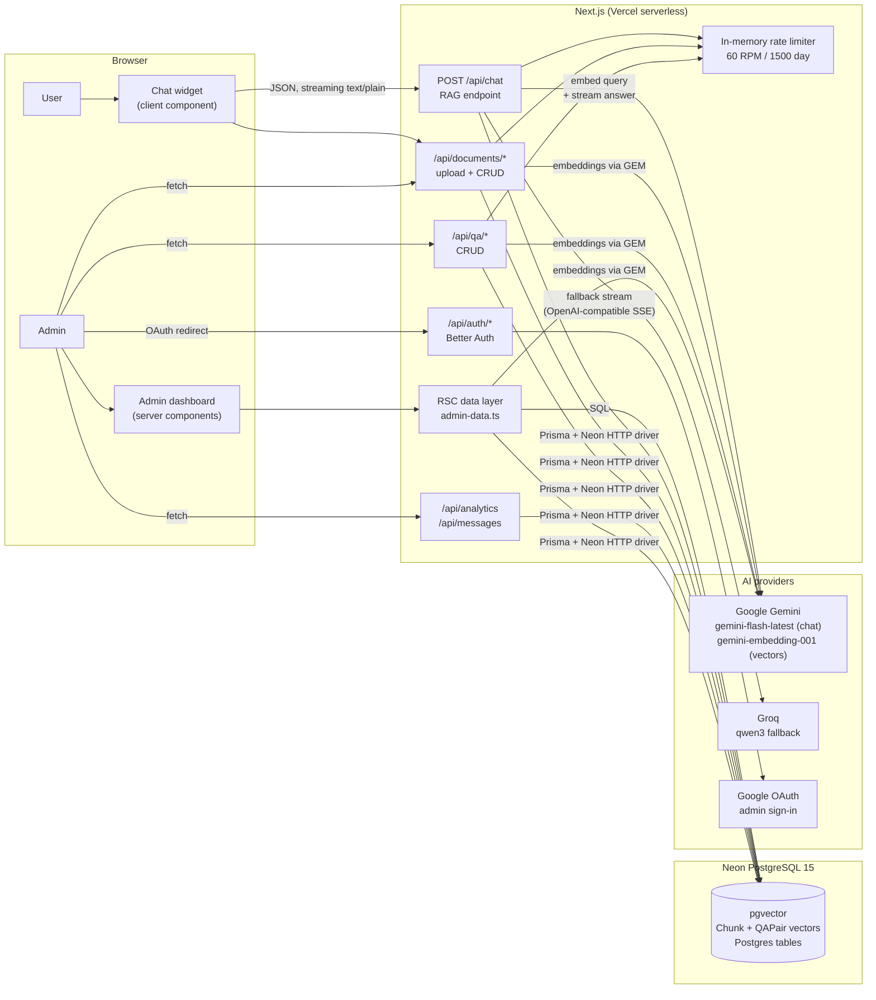
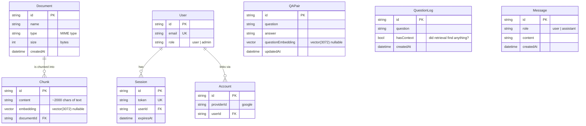
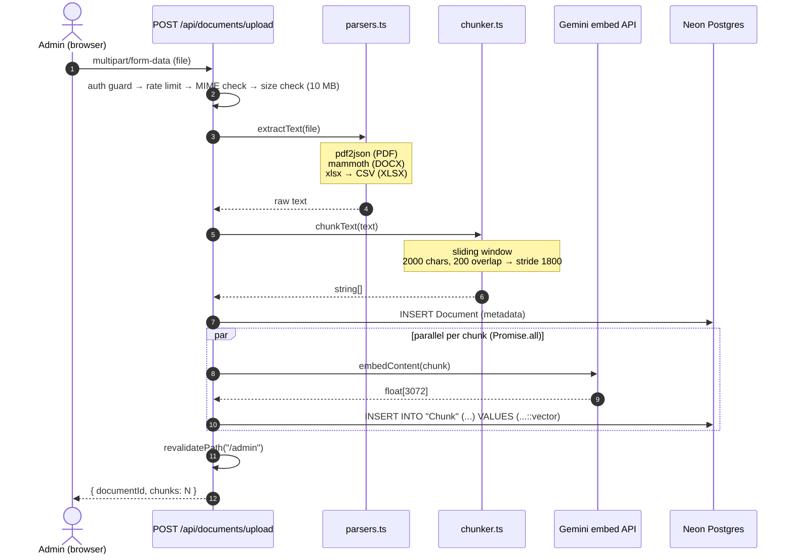
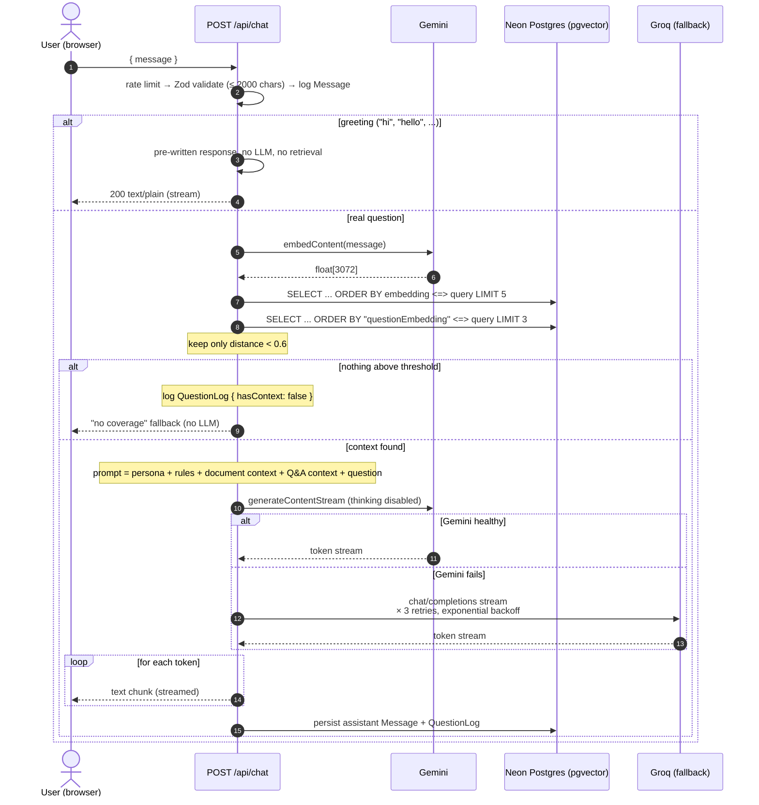
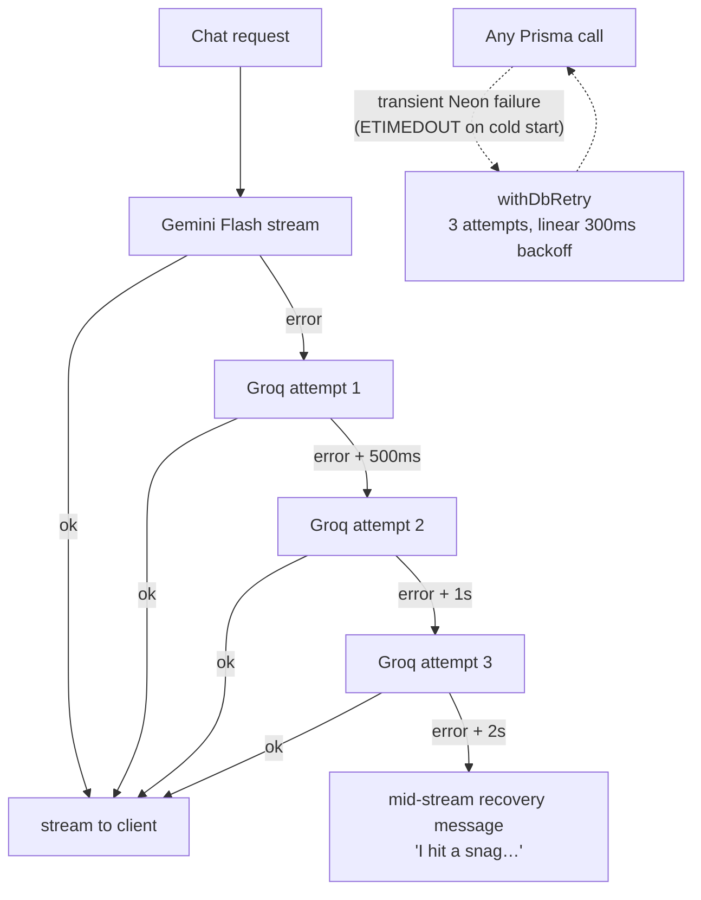

# Architecture

Technical documentation for Gaspy. For setup and usage, see the [README](README.md).

## Contents

- [Background: how RAG works](#background-how-rag-works)
- [System architecture](#system-architecture)
- [Data model](#data-model)
- [Pipelines](#pipelines)
  - [1. Document ingestion](#1-document-ingestion)
  - [2. Q&A pair management](#2-qa-pair-management)
  - [3. Query-time retrieval and generation](#3-query-time-retrieval-and-generation)
- [Concepts and techniques](#concepts-and-techniques)
- [Error handling](#error-handling)
- [Security model](#security-model)
- [Design decisions and trade-offs](#design-decisions-and-trade-offs)
- [Scope and future work](#scope-and-future-work)

---

## Background: how RAG works

LLMs are trained on public data and have no knowledge of private documents. Fine-tuning is expensive and becomes stale when the source material changes. Retrieval-augmented generation (RAG) avoids both problems: instead of encoding knowledge into model weights, relevant text is fetched at query time and provided to the model as context before it answers.

The core primitive is the **embedding**: a model maps a piece of text to a vector in a high-dimensional space (here, 3072 dimensions via `gemini-embedding-001`). Texts with similar meaning are positioned close together regardless of exact wording — *"how do I get my money back?"* is near *"refunds are processed within 5 business days"* even though they share no keywords.

The pipeline has two phases:

1. **Index time** — split documents into overlapping chunks, embed each chunk, store `(text, vector)` rows in Postgres.
2. **Query time** — embed the user's question, find the *k* nearest vectors by cosine distance, include the matching text in the prompt, and constrain the LLM to answer from that context.

Because answers are constrained to retrieved source material, hallucinations are reduced, the knowledge base updates immediately (no retraining), and answers remain traceable to stored content.

---

## System architecture

Gaspy is a single Next.js 16 (App Router) deployment with no separate backend. API routes and React Server Components run on the same serverless functions; vector similarity and filtering are executed in Postgres via pgvector.



Two properties of this design:

- **Postgres is the only stateful dependency.** Vectors, relational data, auth sessions, and analytics all live in one Neon database. This keeps the deployment footprint to one service and makes local setup a single connection string.
- **The Neon HTTP driver** (`PrismaNeonHttp`) runs each query as a stateless HTTP request instead of maintaining a TCP connection pool. Serverless platforms freeze instances and terminate idle connections, which makes traditional pooling unreliable; per-query transport is the appropriate model for that environment.

---

## Data model



| Model | Purpose |
|---|---|
| `Document` / `Chunk` | Uploaded file metadata; chunks carry the 3072-dim embeddings. Deleting a document cascades to its chunks. |
| `QAPair` | Curated question→answer pairs. The *question* is embedded (not the answer) because retrieval matches on what users ask, and answers are injected verbatim into prompts. |
| `QuestionLog` | One row per chat question with a `hasContext` flag. Powers dashboard analytics, including questions the knowledge base could not answer. |
| `Message` | Raw user/assistant transcript log. Currently write-only — see [Scope and future work](#scope-and-future-work). |
| `User` / `Session` / `Account` / `Verification` | Better Auth schema: OAuth-linked identities, server-side sessions, one-time verification tokens. `role` is a custom field. |

Vector columns are declared as `Unsupported("vector(3072)")` in Prisma. Prisma does not model pgvector types natively, so these columns are read and written through raw SQL (`$queryRaw` / `$executeRaw`) while the rest goes through the typed client.

---

## Pipelines

### 1. Document ingestion

An admin uploads a file (PDF / DOCX / XLSX, ≤ 10 MB, MIME allowlist). The route validates the request, extracts text, chunks it, embeds all chunks, and writes rows to Postgres.



Implementation notes:

- **Chunking is a fixed-size sliding window** (`2000` chars, `200` overlap). The overlap ensures a sentence that straddles a boundary appears in full in at least one chunk. 2000 chars ≈ 400–500 tokens: large enough to retain paragraph context, small enough that embeddings stay specific.
- **Embedding calls run concurrently** via `Promise.all` rather than sequentially. Each call is I/O-bound, so for a 50-chunk document this reduces upload time from minutes to seconds.
- **Inserts use `$executeRaw` with a `::vector` cast.** Prisma has no native binding for the pgvector type; the text form `'[0.12,-0.44,...]'::vector` is how pgvector accepts literals.
- **Scanned PDFs fail with a descriptive error** — `pdf2json` cannot extract text from image-only pages, so the route returns a 400 rather than indexing an empty document.

### 2. Q&A pair management

Q&A pairs are the highest-precision part of the knowledge base: an admin writes the exact answer, so generation only rephrases.

The write path is decoupled from the embedding path. `POST /api/qa` inserts the row with a `NULL` embedding and returns immediately, keeping the dashboard responsive. The embedding is generated in a background async block:

```ts
(async () => {
  try {
    const embedding = await createEmbedding(question);
    await prisma.$executeRaw`UPDATE "QAPair" SET "questionEmbedding" = ...`;
  } catch (err) { console.error("Background embedding failed:", err); }
})();
```

The trade-off is intentional: a failed embedding leaves a visible, editable row that is simply excluded from vector search (Postgres sorts `NULL` distances last, so it never enters the top-k), rather than blocking the admin UI on a third-party API call. Updates re-embed **only when the question text changed** — answer edits do not require a new embedding.

### 3. Query-time retrieval and generation

This is the hot path: one user message in, one streamed answer out.



Retrieval runs two searches over the same query vector:

- **Top-5 `Chunk` rows** — the document corpus, where answers typically require synthesis.
- **Top-3 `QAPair` rows** — curated answers, injected into the prompt as `Q:/A:` blocks.

Both use pgvector's `<=>` operator (cosine distance: 0 = identical, 2 = opposite). Results are then filtered by `distance < 0.6`. If nothing passes, the LLM is skipped entirely and a canned "no coverage" response is returned. Supplying an empty context to the LLM is the primary cause of unsupported answers in RAG systems; declining to answer is the correct behavior for a support product, and the miss is logged with `hasContext: false`.

The generation prompt is a single flat prompt: persona, behavioral rules, two context blocks, and the question. `thinkingConfig: { thinkingBudget: 0 }` disables Gemini 2.5's extended thinking mode, which would otherwise add latency to a task that mostly rephrases retrieved text.

---

## Concepts and techniques

A reference for each non-trivial technique in the codebase and its purpose.

**RAG (retrieval-augmented generation)** — fetch relevant knowledge at query time and ground the LLM's answer in it. Addresses staleness and hallucination without fine-tuning.

**Embeddings** — dense float vectors produced by a model (`gemini-embedding-001`, 3072 dims) that position text in a semantic space. Comparing vectors compares meaning.

**Cosine distance `<=>`** — `1 − cosine similarity`. Measures the angle between two vectors, ignoring magnitude — the appropriate metric for text embeddings, where vector length carries little information. pgvector also provides `<->` (L2/Euclidean) and `<#>` (negative inner product); cosine is the standard choice for sentence embeddings.

**Chunking with overlap** — documents are split into ~2000-char windows stepping by 1800 chars, so consecutive chunks share 200 chars. Boundary sentences survive intact in at least one chunk.

**Top-k + relevance threshold** — retrieve a fixed number of nearest neighbors (5 + 3), then discard anything with cosine distance ≥ 0.6. Top-k alone always returns *something*; the threshold distinguishes a weak match from no match, allowing the bot to say it does not know.

**Token streaming** — the LLM API yields tokens as they are generated. The route wraps them in a `ReadableStream` with `TextEncoder` and returns `text/plain`; the client consumes it with `response.body.getReader()` and appends chunks to state. This reduces perceived latency from a multi-second wait to first-token time. Using one format (`text/plain`) for all outcomes (greeting, fallback, LLM stream) keeps the client to a single parsing path.

**SSE parsing (fallback path)** — Groq is called through its OpenAI-compatible endpoint, which streams Server-Sent Events (`data: {...}\n\n` frames terminated by `data: [DONE]`). `groq.ts` parses these with a buffered line reader; partial frames are held back until the next chunk completes them.

**Exponential backoff** — retries wait `base × 2^n` ms (0.5s → 1s → 2s), giving a degraded provider progressively more recovery time. Used for the Groq fallback. Database calls use linear backoff (300ms × attempt) because Neon cold-start failures typically resolve quickly.

**Fire-and-forget async** — starting a promise without awaiting it. Used for Q&A embeddings and `QuestionLog` writes so the HTTP response never waits on them; failures are logged, not fatal. On serverless, the function may be frozen after the response flushes — acceptable here because a missed analytics row or a `NULL` embedding is recoverable.

**Fixed-window rate limiting** — count requests per key in a `Map`, reset when the window expires. Two stacked windows (60/min, 1500/day) mirror the Gemini free-tier quotas. It is in-memory, so it is per-instance and resets on cold start — a documented limitation. It runs before any parsing, so rejected requests cost nothing.

**Serverless connection management** — serverless instances scale to zero and cannot hold reliable TCP pools. The Neon HTTP driver makes each query a stateless fetch, and a `globalThis` singleton prevents dev hot-reload from instantiating multiple clients. `instrumentation.ts` sets `dns.setDefaultResultOrder("ipv4first")`: Neon's pooler advertises AAAA records, and on hosts without IPv6 routes Node resolves to IPv6 and times out.

**React Server Components + `cache()`** — dashboard pages are async server components that query Prisma directly; `force-dynamic` keeps them current. React's `cache()` wraps shared fetchers so multiple panels rendered in one request reuse one result — request-level memoization, not a persistent cache. After mutations, `revalidatePath("/admin")` invalidates the Router Cache.

**Zod validation** — every mutating endpoint parses input through a schema (`chat`: 1–2000 chars; `qa`: 1000/5000). Validation happens at the trust boundary; the client is not trusted.

**Better Auth + OAuth + sessions** — sign-in is Google OAuth 2.0 (authorization code flow, handled by Better Auth). Sessions are rows in the `Session` table referenced by an httpOnly HMAC-signed cookie — unreadable to JavaScript, revocable server-side. The Prisma adapter stores everything in the same Postgres instance; the `role` field is declared `input: false` so it cannot be set through signup.

**Fuzzy search (Fuse.js)** — the admin `Ctrl+K` command palette performs client-side fuzzy matching over dashboard destinations, with no server round-trip.

---

## Error handling

Behavior for each external dependency:



| Failure | Handling |
|---|---|
| Gemini chat model unavailable / quota exhausted | Falls back to Groq (OpenAI-compatible API), 3 retries with exponential backoff |
| Groq also fails, or the stream breaks mid-response | A recovery sentence is appended and the stream closes cleanly; the client keeps any partial answer |
| Neon connection failure (serverless cold start) | `withDbRetry` — 3 attempts, linear backoff |
| Host without IPv6 routes + Neon AAAA records | `dns.setDefaultResultOrder("ipv4first")` set at startup |
| No relevant knowledge retrieved | Skip the LLM, return the no-coverage response, log `hasContext: false` |
| Unexpected route error | Caught at the route boundary; the client receives a plain error message, not a stack trace |

---

## Security model

**Public (no auth):** landing page, chat widget, `POST /api/chat` (rate limited), `/api/health`.

**Protected:** `/admin/*` pages and all admin API routes (`/api/documents`, `/api/qa`, `/api/analytics`, `/api/messages`). Each calls a shared server-side guard (`src/lib/auth-guard.ts`) that validates the Better Auth session from the httpOnly cookie. The client is never trusted; unauthenticated callers receive `401` or a redirect to `/admin/login`.

**Current limitation:** the `role` field and the `make-admin.ts` promotion script exist, but the guard currently treats any authenticated Google account as an admin — the role check was deferred (see [Scope and future work](#scope-and-future-work)). If this is deployed publicly, add the role check or restrict sign-in to a known account.

Secrets (`DATABASE_URL`, `GEMINI_API_KEY`, `BETTER_AUTH_SECRET`, OAuth credentials) are server-side environment variables only; nothing sensitive crosses the client boundary.

### Creating the first admin

1. Sign in once at `/admin/login` with Google (creates the `User` row).
2. Run:

   ```bash
   npx tsx scripts/make-admin.ts your.email@gmail.com
   ```

   The script is standalone: it loads `.env` itself, connects via the Neon adapter, and sets `role` to `admin`. Re-run for additional admins.

---

## Design decisions and trade-offs

**One plain-text stream format for all responses.** Greetings, fallbacks, and LLM output all arrive as `text/plain` chunks from one `ReadableStream`, so the client has a single parsing path. Trade-off: no structured events — errors cannot carry status codes mid-stream and citations cannot accompany tokens. An SSE/NDJSON envelope would address both (see [Scope and future work](#scope-and-future-work)).

**Fire-and-forget embeddings for Q&A.** Rows appear immediately; embeddings are generated in the background. Trade-off: a row can be briefly invisible to search, and on serverless the background promise is not guaranteed to complete after the response. At this write volume, UI latency was prioritized over embedding durability.

**Relevance threshold instead of always answering.** `distance < 0.6` gates the LLM. Trade-off: the bot occasionally declines when a human would have inferred an answer. A support bot that generates unsupported answers is worse than one that acknowledges gaps — and each decline is logged with `hasContext: false`, giving the admin a list of missing coverage.

**Fixed-size chunking over semantic chunking.** Simple and deterministic, with no dependencies. Trade-off: tables and code blocks can be split mid-structure. Acceptable for prose-heavy documents; unsuitable for structured content.

**Everything in one Postgres instance.** Vectors, relations, auth, and analytics in a single database: one service to operate, one backup process, and joins between text and metadata. Trade-off: none of the features of dedicated vector databases (namespaces, built-in hybrid ranking, horizontal scale). At this scale — thousands of vectors, not millions — the simplicity is worth more.

**In-memory rate limiting.** No additional infrastructure, and it mirrors the provider quota exactly. Trade-offs: per-instance only, resets on cold start, and uses a global bucket rather than per-IP keys — all listed in [Scope and future work](#scope-and-future-work).

---

## Scope and future work

A review of what was left out and the current assessment of each item, ordered by priority.

**1. Enforce the admin role.**
The `role` column and promotion script exist, but `guardAdminApi()` / `requireAdmin()` only check session validity. The fix is a `session.user.role === "admin"` check in the guard plus rendering the existing `AccessDenied` component in the dashboard layout. Until then, any Google-authenticated account has admin access — acceptable for a personal deployment, not for public availability.

**2. Multi-turn conversations.**
`Message` rows are persisted but never replayed into the prompt — each question is answered in isolation, so follow-ups like *"what about the free plan?"* lose their referent. The fix has two parts: include the last N messages in the generation prompt, and rewrite follow-up questions into standalone queries before embedding (otherwise the follow-up embeds poorly, since its antecedent is not in the text). This is the largest current UX gap.

**3. User feedback loop.**
Thumbs up/down per answer, stored alongside retrieval metadata. Combined with `QuestionLog.hasContext`, this turns the dashboard from aggregate analytics into a work queue: which answers are rated poorly, not just how many questions were asked.

**4. ANN index on the vector columns.**
`ORDER BY embedding <=> q LIMIT 5` performs an exact sequential scan — acceptable at hundreds of chunks, O(n) at scale. One statement resolves it: `CREATE INDEX ON "Chunk" USING hnsw (embedding vector_cosine_ops)`. Recommended once the corpus reaches ~10k chunks.

**5. Hybrid search.**
Embeddings miss exact tokens — SKU codes, error strings, product names. Adding Postgres full-text (`tsvector`) retrieval and merging results with Reciprocal Rank Fusion covers the lexical tail. Worth implementing once real documents contain identifiers.

**6. Per-IP rate limiting in a shared store.**
Two upgrades to the current limiter: key by IP (or session) instead of the global `"api-chat"` bucket, so one user cannot exhaust the daily quota for everyone; and move counters to a shared store (e.g., Upstash Redis) so limits survive cold starts and apply across instances.

**7. Bounded embedding concurrency on upload.**
`Promise.all` over all chunks is unbounded — a 300-chunk document issues 300 simultaneous requests, which can hit provider rate limits. A concurrency gate (`p-limit(8)`) or batched promise groups keeps uploads reliable without a meaningful slowdown.

**8. Structure-aware chunking and raw file retention.**
Split at heading/paragraph/table boundaries instead of a raw character window. Additionally, retain original files in blob storage so documents can be re-ingested when the chunker or embedding model changes — currently the raw bytes are discarded after extraction.

**9. Citations in the UI.**
`findSimilarChunks` already returns `documentId` — displaying the source document under each answer is mostly frontend work and increases user trust in a support context.

**10. Structured stream protocol.**
Move from `text/plain` to SSE with typed events (`token`, `done`, `error`, `sources`). Removes the current behavior where stream errors arrive as HTTP 200 + prose, and provides a transport for citations and feedback.

**11. RAG evaluation harness.**
No automated quality measurement exists — no golden Q&A set, no retrieval hit-rate, no faithfulness scoring. A small eval script run in CI would detect regressions when prompts, models, or chunking change.

**12. Tests and CI.**
The pure functions — `chunkText`, `checkRateLimit`, the parsers, the SSE line reader, timeline bucketing — are straightforward Vitest targets with no mocking. GitHub Actions for `lint` + `tsc` + those tests completes the engineering workflow.

**13. Question clustering in analytics.**
Top-questions uses exact-string `GROUP BY`, so *"refund?"* and *"Refund!!"* count separately. Clustering (or at least normalization) would reflect themes rather than phrasing. Deferred until traffic volume makes the noise significant.

**14. Observability.**
Structured logs, request tracing, and LLM call telemetry (e.g., Langfuse). The current `console.error` output is functional but not searchable or aggregatable.

**No changes needed:** Postgres over a dedicated vector database, the fallback chain, the stream format, chunk size/overlap, and the free-tier cost model are appropriate at the current scale.
