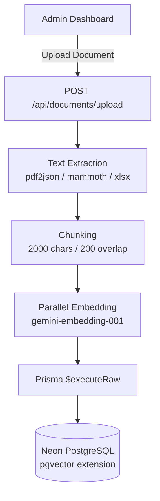
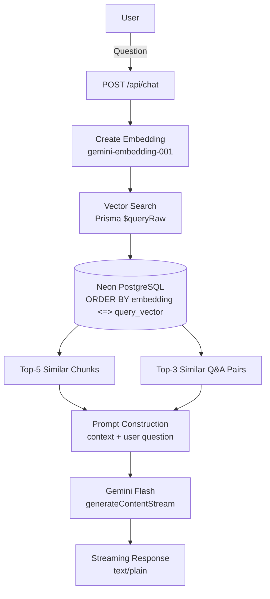

# Gaspy — AI-Powered Customer Support with RAG

A conversational customer support chatbot backed by retrieval-augmented generation (RAG). Admins control the knowledge base through a dashboard: upload documents, curate Q&A pairs, and monitor what users ask.

---

## What It Does

**For end users:**
Open the chat widget, ask a question. The bot retrieves relevant passages from uploaded documents and predefined Q&A pairs, then grounds its answer in that context using Google's Gemini model. No hallucinated claims — every answer is tied to actual source material.

**For admins:**
A dashboard at `/admin` provides:
- **Document ingestion** — upload PDF, DOCX, or XLSX files. Text is extracted, chunked, and vectorized automatically.
- **Q&A curation** — add, edit, or delete question-answer pairs. Each question gets its own embedding for semantic retrieval.
- **Analytics** — see top asked questions and hourly question volume over the last 12 hours.
- **Dark mode toggle** — full theme support with distinct warm color tokens.

> Admin access requires signing in with a Google account that has the `admin` role (see [Authentication](#authentication) below).

---

## Architecture

### Document Ingestion



### Query & Retrieval



---

## Tech Stack

| Layer | Choice |
|-------|--------|
| Framework | Next.js 16 (App Router) |
| Language | TypeScript 5.9 |
| Styling | Tailwind CSS 4 |
| Database | PostgreSQL 15 + pgvector (Neon) |
| ORM | Prisma 7 |
| AI | Google Gemini Flash (chat + embeddings) |
| Charts | Recharts |
| Animations | Framer Motion |
| Icons | Lucide React |
| Validation | Zod |

---

## How the RAG Pipeline Works

1. **Ingestion**
   - Document → `extractText()` (pdf2json / mammoth / xlsx) → raw text
   - `chunkText()` splits into 2000-char chunks with 200-char overlap
   - Each chunk is embedded via `gemini-embedding-001` and stored in the `Chunk` table with a `vector` column

2. **Q&A Pairs**
   - When a pair is created, its question is embedded and stored in `QAPair.questionEmbedding`
   - Embeddings are generated fire-and-forget so the UI stays fast

3. **Retrieval**
   - User message is embedded
   - `findSimilarChunks()` and `findSimilarQAPairs()` run pgvector `<=>` (cosine distance) queries
   - Top-5 chunks and top-3 Q&A pairs are retrieved (no strict threshold — pgvector ranking handles relevance)

4. **Generation**
   - Retrieved context is injected into the prompt
    - Gemini Flash (`gemini-flash-latest`) streams the response back as `text/plain`
    - Falls back to Groq (OpenAI-compatible API) if the primary model is unavailable, with 3 exponential-backoff retries
    - Greetings bypass the LLM entirely — fast path with pre-written responses

---

## Project Structure

```
src/
  app/
    (admin)/admin/          # Dashboard layout + page
    (chat)/chat/             # Standalone chat page
    api/
      chat/route.ts           # RAG chat endpoint
      documents/              # CRUD + upload
      qa/                     # CRUD for Q&A pairs
      analytics/route.ts      # Top questions + timeline
      health/route.ts         # Health check
  components/
    admin/                   # Dashboard components
    chat/                    # Chat widget + input + bubbles
    landing/                 # Homepage (mascot, phone mockup, hero)
    ui/                      # Shared primitives
  lib/
    gemini.ts                # GenAI client
    prisma.ts                # Prisma client with Neon adapter
    embeddings.ts            # createEmbedding + similarity search
    parsers.ts               # PDF/DOCX/XLSX text extraction
    chunker.ts               # Fixed-size text chunking
    admin-data.ts            # Dashboard data fetching
    utils.ts                 # formatHourLabel, formatBytes
    types/index.ts             # Shared TypeScript interfaces
prisma/
  schema.prisma              # Document, Chunk, QAPair, QuestionLog, Message, User, Session, Account, Verification
```

---

## Setup

```bash
# 1. Install dependencies
npm install

# 2. Set up environment variables
cp .env.example .env
# Fill in DATABASE_URL, GEMINI_API_KEY, BETTER_AUTH_SECRET,
# GOOGLE_CLIENT_ID, GOOGLE_CLIENT_SECRET (see Environment Variables below)

# 3. Apply the Prisma migrations to your database
npx prisma migrate deploy

# 4. Run the dev server
npm run dev
```

The app runs at `http://localhost:3000`. Chat widget is on the homepage; admin dashboard is at `/admin` (sign in at `/admin/login`, then promote your account — see [Creating the first admin](#creating-the-first-admin)).

---

## Authentication

The app has a clear public/protected split:

**Public (no login required)**
- `/` landing page and the chat widget
- `POST /api/chat` — the RAG chatbot, protected by an in-memory rate limiter (60 requests/min, 1500 requests/day) enforced server-side before any processing
- `/api/health`

**Protected (Better Auth session + `admin` role, verified server-side)**
- `/admin` — dashboard (unauthenticated users are redirected to `/admin/login`; signed-in users without the `admin` role see an access-denied screen)
- `/api/documents`, `/api/documents/upload`, `/api/documents/[id]`
- `/api/qa`, `/api/qa/[id]`
- `/api/analytics`, `/api/messages`

Auth is handled by [Better Auth](https://better-auth.com) with the Prisma adapter on the existing Neon PostgreSQL database. Sessions are stored in the `Session` table and referenced by an httpOnly, HMAC-signed cookie — no tokens or secrets in URLs. Sign-in uses Google OAuth. Every admin page and API route calls a shared server-side guard (`src/lib/auth-guard.ts`) that validates the session **and** checks `user.role === "admin"` — frontend hiding alone is never relied upon.

### Creating the first admin

Roles are **never** granted automatically at sign-up — every Google-authenticated user starts with the `user` role.

1. Sign in once at `/admin/login` with your Google account (this creates your `User` row with role `user`).
2. Promote your account:

```bash
npx tsx scripts/make-admin.ts your.email@gmail.com
```

3. Reload `/admin` — you now have full dashboard access. Re-run the script with any email to grant additional admins.

---

## Environment Variables

| Variable | Purpose |
|----------|---------|
| `DATABASE_URL` | PostgreSQL connection string (Neon with pgvector) |
| `GEMINI_API_KEY` | Google GenAI API key |
| `GROQ_API_KEY` / `GROQ_MODEL` | Groq fallback for chat responses (optional) |
| `BETTER_AUTH_SECRET` | Better Auth session/cookie signing secret — generate with `openssl rand -base64 32` (**required**) |
| `BETTER_AUTH_URL` | Base URL of the app, e.g. `http://localhost:3000` (recommended in production) |
| `GOOGLE_CLIENT_ID` / `GOOGLE_CLIENT_SECRET` | Google OAuth credentials for admin sign-in (**required**) |

All secrets are server-side only — none are exposed to the browser. `.env` is gitignored; never commit real credentials.

## Cost & Free Tier

The app is designed to run entirely on free tiers:

- **Google GenAI** — 1,500 requests/day at 60 RPM (Gemini Flash + Embeddings)
- **Neon Postgres** — Free tier with pgvector extension
- **Vercel** — Hobby tier (serverless functions)

An in-memory rate limiter enforces these caps automatically. If you hit the daily limit, the API returns `429 Too Many Requests` until the next day.

---

## Key Design Decisions

**Streaming responses**
The chat API always returns `text/plain` via `ReadableStream`, whether the answer comes from a greeting fast-path, a no-context fallback, or a live Gemini stream. The client handles one format only.

**Fire-and-forget embeddings**
Q&A pairs are inserted immediately so the UI feels instant. The embedding is generated in a background async block. If it fails, the pair still exists — the admin can see it, and the next query will simply skip it in vector search.

**Parallel chunk embedding**
Document uploads batch all chunk embeddings with `Promise.all` instead of sequential `await`, cutting upload time for large files significantly.

**Server-side data fetching with React `cache()`**
Dashboard data is fetched inside async server components using `cache()` so multiple panels sharing the same dataset don't duplicate DB queries.

**Admin protection**
Authentication uses Better Auth with the Prisma adapter (User/Session/Account/Verification tables on the existing Neon database). `/admin` and every admin API route perform a server-side session + `admin` role check (`src/lib/auth-guard.ts`); unauthenticated callers get a redirect/401 and authenticated non-admins get an access-denied screen/403. The public chatbot and `POST /api/chat` remain open — the in-memory rate limiter (60/min, 1500/day, enforced before any processing) protects the GenAI free-tier quota.

---

## License

MIT