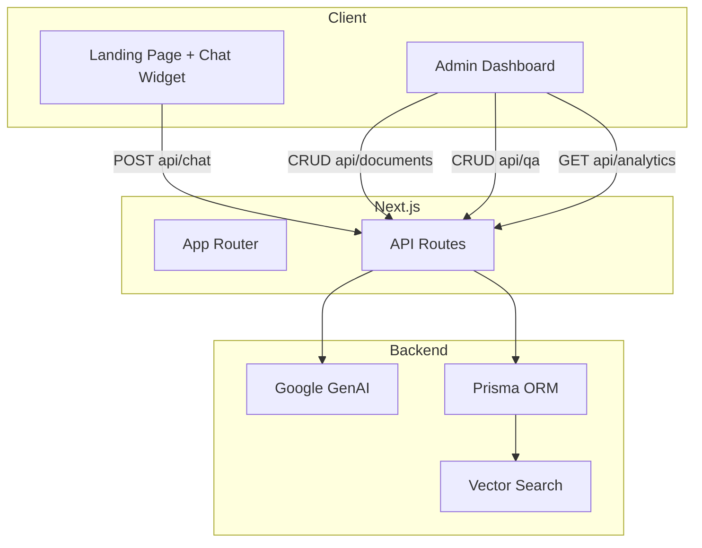

# Gaspy — AI-Powered Customer Support with RAG

A conversational customer support chatbot backed by retrieval-augmented generation (RAG). Admins control the knowledge base through a dashboard: upload documents, curate Q&A pairs, and monitor what users ask.

---

## What It Does

**For end users:**
Open the chat widget, ask a question. The bot retrieves relevant passages from uploaded documents and predefined Q&A pairs, then grounds its answer in that context using Google's Gemini model. No hallucinated claims — every answer is tied to actual source material.

**For admins:**
A dashboard at `/admin` provides:
- **Document ingestion** — upload PDF, DOCX, or XLSX files. Text is extracted, chunked, and vectorized automatically.
- **Q&A curation** — add, edit, or delete question-answer pairs. Each question gets its own embedding for semantic retrieval.
- **Analytics** — see top asked questions and hourly question volume over the last 12 hours.
- **Dark mode toggle** — full theme support with distinct warm color tokens.

---

## Architecture



---

## Tech Stack

| Layer | Choice |
|-------|--------|
| Framework | Next.js 16 (App Router) |
| Language | TypeScript 5.9 |
| Styling | Tailwind CSS 4 |
| Database | PostgreSQL 15 + pgvector (Neon) |
| ORM | Prisma 7 |
| AI | Google Gemini Flash (chat + embeddings) |
| Charts | Recharts |
| Animations | Framer Motion |
| Icons | Lucide React |
| Validation | Zod |

---

## How the RAG Pipeline Works

1. **Ingestion**
   - Document → `extractText()` (pdf-parse-new / mammoth / xlsx) → raw text
   - `chunkText()` splits into 2000-char chunks with 200-char overlap
   - Each chunk is embedded via `gemini-embedding-001` and stored in the `Chunk` table with a `vector` column

2. **Q&A Pairs**
   - When a pair is created or updated, its question is embedded and stored in `QAPair.questionEmbedding`
   - Embeddings are generated fire-and-forget so the UI stays fast

3. **Retrieval**
   - User message is embedded
   - `findSimilarChunks()` and `findSimilarQAPairs()` run pgvector `<=>` (cosine distance) queries
   - Results are filtered by `SIMILARITY_THRESHOLD` (configurable via env, default 0.5)

4. **Generation**
   - Retrieved context is injected into the prompt
   - Gemini Flash streams the response back as `text/plain`
   - Greetings bypass the LLM entirely — fast path with pre-written responses

---

## Project Structure

```
src/
  app/
    (admin)/admin/          # Dashboard layout + page
    (chat)/chat/             # Standalone chat page
    api/
      chat/route.ts           # RAG chat endpoint
      documents/              # CRUD + upload
      qa/                     # CRUD for Q&A pairs
      analytics/route.ts      # Top questions + timeline
      health/route.ts         # Health check
  components/
    admin/                   # Dashboard components
    chat/                    # Chat widget + input + bubbles
    landing/                 # Homepage (mascot, phone mockup, hero)
    ui/                      # Shared primitives
  lib/
    gemini.ts                # GenAI client
    prisma.ts                # Prisma client with Neon adapter
    embeddings.ts            # createEmbedding + similarity search
    parsers.ts               # PDF/DOCX/XLSX text extraction
    chunker.ts               # Fixed-size text chunking
    admin-data.ts            # Dashboard data fetching
    utils.ts                 # formatHourLabel, formatBytes
  types/index.ts             # Shared TypeScript interfaces
prisma/
  schema.prisma              # Document, Chunk, QAPair, QuestionLog, Message
```

---

## Setup

```bash
# 1. Install dependencies
npm install

# 2. Set up environment variables
cp .env.example .env
# Fill in DATABASE_URL, GEMINI_API_KEY, SIMILARITY_THRESHOLD

# 3. Push the Prisma schema to your database
npx prisma migrate dev --name init

# 4. Run the dev server
npm run dev
```

The app runs at `http://localhost:3000`. Chat widget is on the homepage; admin dashboard is at `/admin`.

---

## Environment Variables

| Variable | Purpose |
|----------|---------|
| `DATABASE_URL` | PostgreSQL connection string ( Neon with pgvector ) |
| `GEMINI_API_KEY` | Google GenAI API key |
| `SIMILARITY_THRESHOLD` | Vector distance cutoff for retrieval (default: 0.5) |

---

## Key Design Decisions

**Streaming responses**  
The chat API always returns `text/plain` via `ReadableStream`, whether the answer comes from a greeting fast-path, a no-context fallback, or a live Gemini stream. The client handles one format only.

**Fire-and-forget embeddings**  
Q&A pairs are inserted immediately so the UI feels instant. The embedding is generated in a background async block. If it fails, the pair still exists — the admin can see it, and the next query will simply skip it in vector search.

**Parallel chunk embedding**  
Document uploads batch all chunk embeddings with `Promise.all` instead of sequential `await`, cutting upload time for large files significantly.

**Server-side data fetching with React `cache()`**  
Dashboard data is fetched inside async server components (`DashboardData.tsx`) using `cache()` so multiple panels sharing the same dataset don't duplicate DB queries.

**Revalidation on mutations**  
All document and Q&A mutations call `revalidatePath('/admin')`, keeping React's server cache in sync with actual DB state.

---

## Production Roadmap

If this were deployed to production, the next priorities would be:

### 1. Authentication
The admin dashboard is currently unprotected. A production deployment needs at minimum a password gate; ideally OAuth (NextAuth or Clerk) with role-based access so support managers can edit Q&A but not delete documents.

### 2. Rate Limiting
`POST /api/chat` and `POST /api/documents/upload` hit paid APIs. Without rate limits, a single script can drain credits or DOS the upload pipeline. `@upstash/ratelimit` or a Redis-backed middleware per IP would be the standard fix.

### 3. Model Upgrades & Fallbacks
Gemini Flash is fast and cheap, but for high-stakes answers (e.g., legal or medical contexts), a fallback to Gemini Pro or even a self-hosted model makes sense. The model string is already centralized in `lib/gemini.ts` — swapping it is trivial.

### 4. Chatbot Testing Suite
Every change to the prompt or similarity threshold can shift answer quality. A proper test suite would:
- Maintain a labeled dataset of 50–100 real user questions with expected answers
- Run each through the pipeline programmatically
- Score retrieval precision/recall and generation faithfulness
- Tune `SIMILARITY_THRESHOLD` against that dataset rather than guessing

### 5. Threshold Tuning at Scale
The current `0.5` cutoff is a starting point. In production, you would:
- Log every query with its top-k distances
- A/B test different thresholds against user feedback (thumbs up/down)
- Possibly make the threshold dynamic per query type

### 6. Observability
Add structured logging and trace IDs through the RAG pipeline so you can answer: "For this user's question, what chunks were retrieved? What was the prompt? What did the model return?" Tools like LangSmith or a simple SQLite audit log would work.

### 7. Multimodal RAG
The parser groundwork is already there (PDF, DOCX, XLSX). The next step is image extraction from PDFs and table understanding from spreadsheets, feeding structured representations into the context window.

---

## License

MIT
