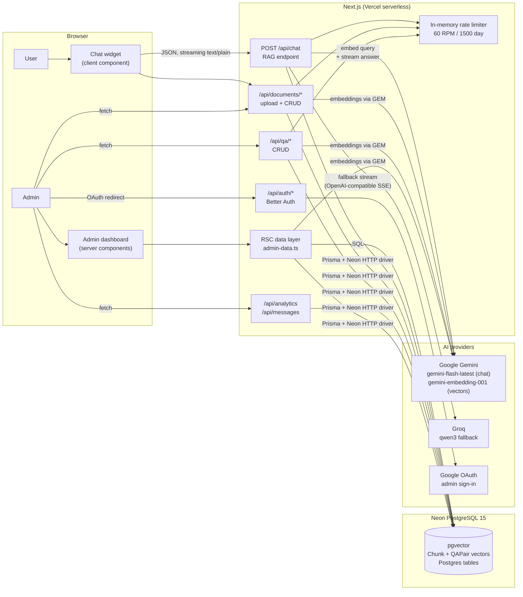
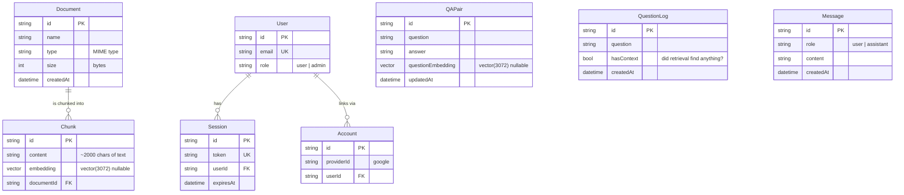
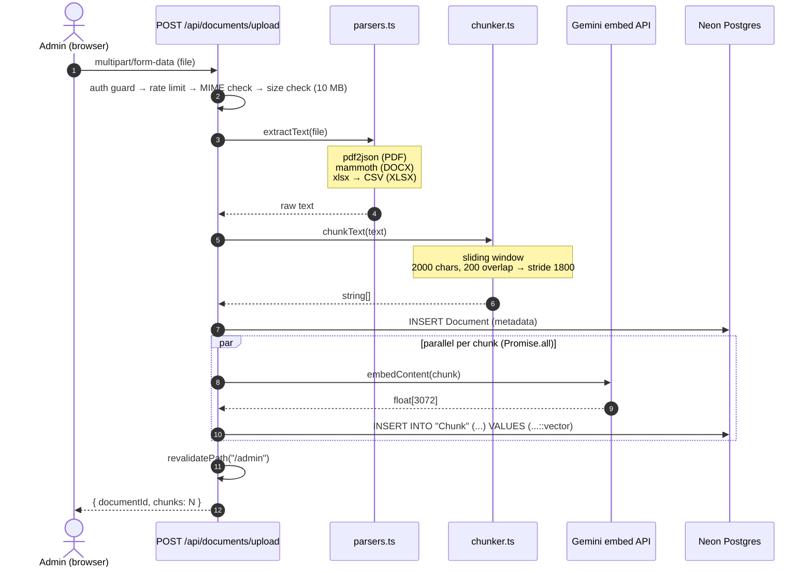
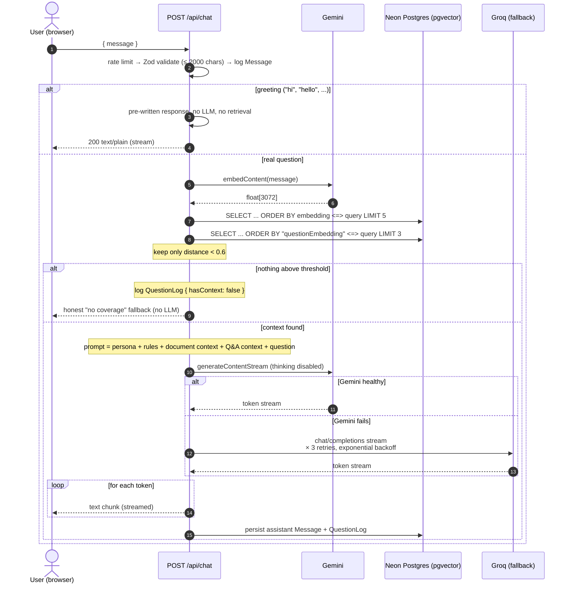
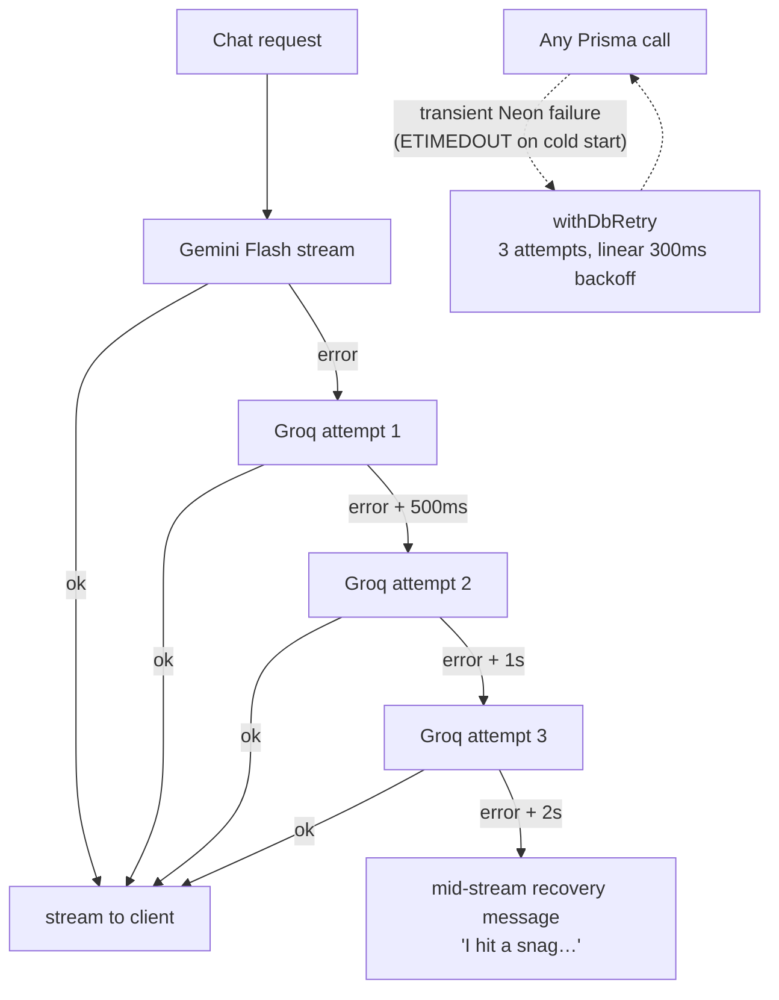

# Gaspy — a production-shaped RAG support assistant

Gaspy is a customer-support chatbot built on **retrieval-augmented generation (RAG)**. Users ask questions in a chat widget; the server embeds the question, pulls the closest passages out of a pgvector-backed knowledge base, and streams a grounded answer from an LLM. Admins manage everything — document ingestion, curated Q&A pairs, and usage analytics — from a dashboard at `/admin`.

It was originally built as a take-home assignment and has since evolved into a portfolio project. The goal of this document is to explain not just *what* it does, but *why* each piece exists and what I'd change with more time.

<!-- TODO: drop real screenshots here (landing, chat, dashboard) when you have them
<p align="center">
  
  
</p>
-->

---

## Table of contents

- [How RAG works (the 60-second version)](#how-rag-works-the-60-second-version)
- [System architecture](#system-architecture)
- [Data model](#data-model)
- [The three pipelines](#the-three-pipelines)
  - [1. Document ingestion](#1-document-ingestion)
  - [2. Q&A pair management](#2-qa-pair-management)
  - [3. Query-time retrieval & generation](#3-query-time-retrieval--generation)
- [Concepts used, explained](#concepts-used-explained)
- [Resilience strategy](#resilience-strategy)
- [Security model](#security-model)
- [Project structure](#project-structure)
- [Running it locally](#running-it-locally)
- [Environment variables](#environment-variables)
- [Design decisions & trade-offs](#design-decisions--trade-offs)
- [Known gaps & what I'd build next](#known-gaps--what-id-build-next)
- [License](#license)

---

## How RAG works (the 60-second version)

LLMs are good at language, bad at your private data. Fine-tuning is expensive and stale the moment a PDF changes. RAG takes a different approach: instead of baking knowledge into model weights, it **fetches relevant text at query time and lets the model read it before answering**.

The core primitive is the **embedding**: a neural network maps a piece of text to a point in a high-dimensional vector space (here, 3072 dimensions via `gemini-embedding-001`). Texts with similar meaning land close together, regardless of exact wording — so *"how do I get my money back?"* sits near *"refunds are processed within 5 business days"*, even though they share no keywords.

That gives us the pipeline:

1. **Index time** — split documents into overlapping chunks, embed each chunk, store `(text, vector)` in Postgres.
2. **Query time** — embed the user's question, find the *k* nearest vectors by cosine distance, paste the matching text into the prompt, and let the LLM answer *only from that context*.

Because the answer is constrained to retrieved source material, hallucinations drop sharply, the knowledge base updates instantly (no retraining), and every answer is traceable to stored content.

---

## System architecture

Gaspy is a single Next.js 16 (App Router) deployment. There is no separate backend — API routes and React Server Components run on the same serverless functions, and all heavy lifting (vector math, filtering) is pushed down to Postgres via pgvector.



Two things worth noticing:

- **Postgres is the only stateful dependency.** Vectors, relational data, auth sessions, and analytics all live in one Neon database. That keeps the free-tier footprint to a single service and makes local setup one connection string.
- **Neon's HTTP driver** (`PrismaNeonHttp`) runs each query as a stateless HTTP request instead of holding a long-lived TCP pool. Serverless platforms freeze instances and kill idle connections unpredictably; stateless per-query transport is the correct answer for that environment (see [Connection management](#concepts-used-explained)).

---

## Data model



| Model | Purpose |
|---|---|
| `Document` / `Chunk` | Uploaded file metadata; chunks carry the 3072-dim embeddings. Deleting a document cascades to its chunks. |
| `QAPair` | Curated question→answer pairs. The *question* is embedded (not the answer) because retrieval matches on what users ask, and answers get injected verbatim. |
| `QuestionLog` | One row per chat question, with a `hasContext` flag. Powers all dashboard analytics, including "questions we couldn't answer" — the most actionable metric for a support bot. |
| `Message` | Raw user/assistant transcript log. Currently write-only (see [Known gaps](#known-gaps--what-id-build-next) — conversations aren't replayed into prompts yet). |
| `User` / `Session` / `Account` / `Verification` | Better Auth's schema: OAuth-linked identities, server-side sessions, and one-time verification tokens. `role` is a custom field. |

Vector columns are declared as `Unsupported("vector(3072)")` in Prisma — Prisma can't model pgvector types natively, so these columns are managed through raw SQL (`$queryRaw` / `$executeRaw`) while everything else goes through the typed client.

---

## The three pipelines

### 1. Document ingestion

An admin uploads a file (PDF / DOCX / XLSX, ≤ 10 MB, MIME allowlist). The route validates, extracts text, chunks it, embeds all chunks in parallel, and writes rows to Postgres.



Details that matter:

- **Chunking is a fixed-size sliding window** (`2000` chars, `200` overlap). The overlap prevents a sentence that straddles a boundary from being cut out of *both* neighbors — at least one chunk always contains it whole. 2000 chars ≈ 400–500 tokens: big enough to keep a paragraph's context, small enough that embeddings stay specific.
- **Embedding calls run concurrently** with `Promise.all` instead of sequentially — for a 50-chunk document that's the difference between seconds and minutes, since each embedding request is I/O-bound, not CPU-bound.
- **Inserts use `$executeRaw` with a `::vector` cast** because Prisma has no native binding for the pgvector type; the text form `'[0.12,-0.44,...]'::vector` is how pgvector accepts literals.
- **Scanned PDFs fail loudly** — `pdf2json` can't extract text from image-only pages, so the route returns a descriptive 400 rather than silently indexing nothing.

### 2. Q&A pair management

Q&A pairs are the highest-precision part of the knowledge base — an admin writes the exact answer, so there's no generation step at retrieval time beyond phrasing.

The interesting bit is the **write path is decoupled from the embedding path**. `POST /api/qa` inserts the row with a `NULL` embedding immediately and returns, so the dashboard feels instant. The embedding is then generated in a **fire-and-forget async block**:

```ts
(async () => {
  try {
    const embedding = await createEmbedding(question);
    await prisma.$executeRaw`UPDATE "QAPair" SET "questionEmbedding" = ...`;
  } catch (err) { console.error("Background embedding failed:", err); }
})();
```

The trade-off is deliberate: a failed embedding leaves a visible, editable row that's simply invisible to vector search (Postgres sorts `NULL` distances last, so it never makes the top-k), rather than blocking the admin's UI on a third-party API call. Updates re-embed **only when the question text actually changed** — answers are free to edit without paying for a new embedding.

### 3. Query-time retrieval & generation

This is the hot path. One user message in, one streamed answer out.



Retrieval runs **two searches in sequence** over the same query vector:

- **Top-5 `Chunk` rows** — the document corpus, where the answer usually needs synthesis.
- **Top-3 `QAPair` rows** — curated answers, injected verbatim into the prompt as `Q:/A:` blocks.

Both use pgvector's `<=>` operator (cosine distance, 0 = identical, 2 = opposite). Results are then filtered by `distance < 0.6` — a soft relevance gate. If nothing passes, we skip the LLM entirely and return a canned "I don't have that covered yet" answer. Feeding an empty context into the LLM is the #1 cause of confident hallucinations in RAG systems; refusing to answer is strictly better for a support product.

The generation prompt is a single flat prompt (persona + behavioral rules + two context blocks + the question). `thinkingConfig: { thinkingBudget: 0 }` disables Gemini 2.5's extended "thinking" mode — it's a latency tax on a task where the model is just rephrasing retrieved text.

---

## Concepts used, explained

A quick glossary of every non-trivial technique in the codebase, and why it's there.

**RAG (retrieval-augmented generation)** — fetch relevant knowledge at query time and ground the LLM's answer in it. Solves staleness and hallucination without fine-tuning.

**Embeddings** — dense float vectors produced by a model (`gemini-embedding-001`, 3072 dims) that position text in a semantic space. Comparing vectors compares *meaning*.

**Cosine distance `<=>`** — `1 − cosine similarity`. Measures the angle between two vectors, ignoring magnitude — the right metric for text embeddings, where vector length carries little meaning. pgvector also offers `<->` (L2/Euclidean) and `<#>` (negative inner product); cosine is the standard default for sentence embeddings.

**Chunking with overlap** — documents are split into ~2000-char windows stepping by 1800 chars, so consecutive chunks share 200 chars. Boundary sentences survive in at least one chunk; retrieval granularity stays fine enough for specific answers.

**Top-k + relevance threshold** — retrieve a fixed number of nearest neighbors (5 + 3), then drop anything with cosine distance ≥ 0.6. Top-k alone always returns *something*; the threshold distinguishes "weak match" from "no match" so the bot can say *I don't know*.

**Token streaming** — the LLM API yields tokens as they're generated. The route wraps them in a `ReadableStream` with `TextEncoder` and returns `text/plain`; the client consumes it with `response.body.getReader()` and appends chunks to state. First-token latency feels instant instead of a multi-second blank screen. One format (`text/plain`) for all outcomes (greeting, fallback, LLM stream) keeps the client dead simple.

**SSE parsing (fallback path)** — Groq is called through its OpenAI-compatible endpoint, which streams **Server-Sent Events** (`data: {...}\n\n` frames terminated by `data: [DONE]`). `groq.ts` parses that manually with a buffered line reader — partial frames are held back until the next chunk completes them.

**Exponential backoff** — retries wait `base × 2^n` ms (0.5s → 1s → 2s) so a struggling provider gets progressively more breathing room instead of being hammered. Used for the Groq fallback; DB calls use gentler *linear* backoff (300ms × attempt) since Neon cold-start failures resolve in tens of ms.

**Fire-and-forget async** — kicking off a promise without awaiting it. Used for Q&A embeddings and `QuestionLog` writes: the HTTP response never waits on them, and failures are logged, not fatal. On serverless, the function may be frozen after the response flushes — acceptable here because a missed analytics row or a NULL embedding is recoverable, and the happy path completes within the same invocation.

**Fixed-window rate limiting** — count requests per key in a `Map`, reset when the window expires. Two stacked windows here (60/min, 1500/day) mirror Gemini's free-tier quotas exactly. It's in-memory, so it's per-instance and resets on cold start — a known limitation, listed below. It also runs *before* parsing, so rejected requests cost nothing.

**Serverless connection management** — serverless instances scale to zero and can't hold reliable TCP pools. The Neon **HTTP driver** makes each query a stateless fetch, and a `globalThis` singleton prevents dev hot-reload from instantiating multiple clients. `instrumentation.ts` additionally forces `dns.setDefaultResultOrder("ipv4first")` — Neon's pooler advertises AAAA records, and on hosts without IPv6 routes Node would pick IPv6 and time out. A one-line fix for a genuinely maddening bug.

**React Server Components + `cache()`** — dashboard pages are async server components that query Prisma directly; `force-dynamic` keeps them live. React's `cache()` wraps shared fetchers so multiple panels rendered in one pass reuse one result per request — request-level memoization, not a cache in the storage sense. After mutations, `revalidatePath("/admin")` invalidates the Router Cache so the next navigation refetches.

**Zod validation** — every mutating endpoint parses input through a schema (`chat`: 1–2000 chars; `qa`: 1000/5000). Validation happens at the trust boundary; the client is never trusted.

**Better Auth + OAuth + sessions** — sign-in is Google OAuth 2.0 (authorization code flow handled by Better Auth). Sessions are rows in the `Session` table referenced by an **httpOnly, HMAC-signed cookie** — unreadable to JS, immune to token-in-URL leaks, revocable server-side. The Prisma adapter stores everything in the same Postgres instance; the `role` field is declared `input: false` so it can never be set through signup.

**Fuzzy search (Fuse.js)** — the admin `Ctrl+K` command palette does client-side fuzzy matching across dashboard destinations — no server round-trip for navigation.

---

## Resilience strategy

Every external dependency has a failure story:



| Failure | Handling |
|---|---|
| Gemini chat model down / quota exhausted | Falls back to Groq (`qwen` via OpenAI-compatible API), 3 retries with exponential backoff |
| Groq also fails / stream breaks mid-flight | Client already has a partial answer; a recovery sentence is appended and the stream closes cleanly |
| Neon connection blip (serverless cold start) | `withDbRetry` — 3 attempts, linear backoff |
| IPv6-less host + Neon AAAA records | `dns.setDefaultResultOrder("ipv4first")` at boot |
| No relevant knowledge | Skip the LLM, return an honest no-coverage answer, log `hasContext: false` |
| Any unexpected route error | Caught at the boundary; user gets a friendly message, never a stack trace |

---

## Security model

**Public (no auth):** landing page, chat widget, `POST /api/chat` (guarded by the rate limiter), `/api/health`.

**Protected:** `/admin/*` pages and all admin API routes (`/api/documents`, `/api/qa`, `/api/analytics`, `/api/messages`). Every one of them calls a shared server-side guard (`src/lib/auth-guard.ts`) that validates the Better Auth session from the httpOnly cookie — the client is never trusted, and unauthenticated callers get `401` or a redirect to `/admin/login`.

**Honest caveat:** the `role` field and the `make-admin.ts` promotion script exist, but the guard currently treats *any* authenticated Google account as an admin — the role check was deferred (it's the first item in [Known gaps](#known-gaps--what-id-build-next)). If you deploy this publicly, either add the role check or keep sign-in restricted to your own Google account.

Secrets (`DATABASE_URL`, `GEMINI_API_KEY`, `BETTER_AUTH_SECRET`, OAuth credentials) are server-only environment variables; nothing sensitive crosses the client boundary. `.env` is gitignored; `.env.example` documents the shape.

### Creating the first admin

1. Sign in once at `/admin/login` with Google (creates your `User` row).
2. Promote yourself:

   ```bash
   npx tsx scripts/make-admin.ts your.email@gmail.com
   ```

   The script is standalone: it loads `.env` itself (minimal parser, no deps), connects via the Neon adapter, and flips `role` to `admin`. Re-run for additional admins.

---

## Project structure

```
src/
  app/
    (admin)/admin/
      (dashboard)/            # Auth-guarded dashboard layout + pages
        page.tsx              #   overview (KPIs, activity, charts)
        knowledge/            #   document upload + list
        qa/                   #   Q&A pair manager
        analytics/            #   top questions + timeline
        settings/             #   theme control
      login/                  # Google sign-in
    (chat)/chat/              # Standalone full-page chat
    api/
      chat/route.ts           # The RAG endpoint
      auth/[...all]/          # Better Auth catch-all handler
      documents/              # GET list, upload, DELETE by id
      qa/                     # GET/POST, PUT/DELETE by id
      analytics/route.ts      # Range-based analytics JSON
      messages/route.ts       # Raw transcript dump
      health/route.ts
  components/
    admin/                    # Dashboard UI (sidebar, KPIs, uploader, QA manager…)
    chat/                     # ChatWindow, ChatInput, MessageBubble, TypingIndicator
    landing/                  # Hero, mascot, phone mockup
    ui/                       # Primitives + Ctrl+K command palette (Fuse.js)
  lib/
    gemini.ts                 # GenAI client
    groq.ts                   # OpenAI-compatible SSE fallback client
    embeddings.ts             # createEmbedding + pgvector top-k queries
    chunker.ts                # Sliding-window chunking
    parsers.ts                # pdf2json / mammoth / xlsx extraction
    prisma.ts                 # PrismaClient + Neon HTTP adapter singleton
    db-retry.ts               # withDbRetry (linear backoff)
    rate-limiter.ts           # Fixed-window limiter (60 RPM / 1500 day)
    auth.ts                   # Better Auth config (Prisma adapter, Google)
    auth-guard.ts             # Server-side session guard
    admin-data.ts             # Dashboard queries (KPIs, analytics, activity)
    utils.ts
  instrumentation.ts          # ipv4first DNS boot hook
  generated/prisma/           # Prisma client output (generated)
prisma/
  schema.prisma
  migrations/
scripts/
  make-admin.ts               # Standalone role promotion script
```

---

## Running it locally

Requirements: Node 20+, a Neon (or any Postgres 15+ with the `pgvector` extension) database.

```bash
# 1. Install
npm install

# 2. Configure
cp .env.example .env
# fill in DATABASE_URL, GEMINI_API_KEY, BETTER_AUTH_SECRET,
# GOOGLE_CLIENT_ID, GOOGLE_CLIENT_SECRET (table below)

# 3. Migrate
npx prisma migrate deploy

# 4. Run
npm run dev
```

Chat widget: homepage (`/`) or `/chat`. Dashboard: `/admin` → sign in at `/admin/login` → run `make-admin.ts` (above).

**Environment variables**

| Variable | Purpose |
|---|---|
| `DATABASE_URL` | Postgres connection string — Neon with pgvector |
| `GEMINI_API_KEY` | Google AI Studio key (chat + embeddings) |
| `GEMINI_MODEL` | Optional, default `gemini-flash-latest` |
| `GROQ_API_KEY` / `GROQ_MODEL` | Optional fallback; default model `qwen/qwen3.8-27b` |
| `BETTER_AUTH_SECRET` | Session cookie signing secret — `openssl rand -base64 32` (**required**) |
| `BETTER_AUTH_URL` | App base URL, e.g. `http://localhost:3000` |
| `GOOGLE_CLIENT_ID` / `GOOGLE_CLIENT_SECRET` | Google OAuth credentials (**required**) |

The whole stack runs on free tiers: Gemini (1,500 req/day @ 60 RPM — enforced by the limiter), Neon (serverless Postgres + pgvector), Vercel Hobby.

---

## Design decisions & trade-offs

Each of these was a conscious choice. I'm listing them with the downside included, because that's the interesting part.

**One plain-text stream format for everything.** Greetings, fallbacks, and LLM output all arrive as `text/plain` chunks from one `ReadableStream`. The client has exactly one parsing path. Trade-off: no structured events, so errors can't carry status codes mid-stream and citations can't ride along with tokens. An SSE/NDJSON envelope would fix both — deferred (see gaps).

**Fire-and-forget over awaiting embeddings.** Q&A rows appear instantly; embeddings catch up in the background. Trade-off: a row can briefly be invisible to search, and on serverless the background promise isn't guaranteed to survive the response. For this write volume, UI latency was worth more than embedding durability.

**Relevance threshold instead of "always answer".** `distance < 0.6` gates the LLM. Trade-off: occasionally the bot refuses when a human would have guessed; but a support bot that confidently invents answers is worse than one that admits gaps — and the refusal is logged with `hasContext: false`, which becomes a to-do list for the admin.

**Fixed-size chunking over semantic chunking.** Simple, deterministic, zero dependencies. Trade-off: tables and code blocks get sliced mid-structure. Fine for prose-heavy support docs; wrong tool for structured content (see gaps).

**Everything in one Postgres.** Vectors, relations, auth, analytics — one service, one backup story, joins between text and metadata for free. Trade-off: no dedicated vector DB features (namespaces, hybrid ranking built-in, horizontal scale). At this scale — thousands of vectors, not millions — Postgres wins on simplicity every time.

**In-memory rate limiting.** Zero infrastructure, exact mirror of the provider quota. Trade-off: per-instance, resets on cold start, and the bucket is global rather than per-IP — three real limitations, all listed below.

---

## Known gaps & what I'd build next

The honest scope review — what I left out, why, and whether it's worth doing. Ordered by leverage.

**1. Enforce the admin role (30 minutes, do this first).**
The `role` column and promotion script exist, but `guardAdminApi()` / `requireAdmin()` only check session validity. The fix is a `session.user.role === "admin"` check in the guard + an `AccessDenied` render (the component already exists) in the dashboard layout. Until then, any Google-authenticated account has admin access — fine for a personal deployment, not shippable as-is.

**2. Multi-turn conversations (high product value).**
`Message` rows are persisted but never replayed into the prompt — every question is answered in isolation, so follow-ups like *"what about the free plan?"* lose their antecedent. The fix is two-part: include the last N messages in the generation prompt, and **rewrite follow-up questions into standalone queries** ("condensation") before embedding — otherwise the follow-up embeds poorly because it references context that isn't in the text. This is the single biggest UX gap today.

**3. User feedback loop (high product value, low effort).**
Thumbs up/down per answer, stored next to the retrieval metadata. Combined with `QuestionLog.hasContext`, this turns the dashboard from analytics into a work queue: *which* answers are bad, not just *how many* questions were asked. Cheap to build, compounds with everything else.

**4. ANN index on the vector columns (30 minutes, do it before ~10k chunks).**
`ORDER BY embedding <=> q LIMIT 5` currently does an exact sequential scan — perfectly fine at hundreds of chunks, O(n) at scale. One statement fixes it: `CREATE INDEX ON "Chunk" USING hnsw (embedding vector_cosine_ops)`. No behavior change, just asymptotics.

**5. Hybrid search (medium effort, niche but real wins).**
Embeddings miss exact tokens — SKU codes, error strings, product names. Adding Postgres full-text (`tsvector`) retrieval and merging with Reciprocal Rank Fusion covers the lexical tail. Worth it once real documents contain identifiers.

**6. Per-IP rate limiting in a shared store (needs doing before public traffic).**
Two upgrades to the current limiter: key by IP (or session) instead of the global `"api-chat"` bucket, so one user can't burn the daily quota for everyone; and move counters to Upstash Redis so limits survive cold starts and apply across instances. Straightforward, unglamorous, necessary.

**7. Bounded embedding concurrency on upload.**
`Promise.all` over all chunks is unbounded — a 300-chunk document fires 300 simultaneous Gemini calls, which can trip provider rate limits. A tiny concurrency gate (`p-limit(8)`) or batched `Promise.all` chunks keeps uploads reliable without meaningfully slowing them.

**8. Structure-aware chunking (only if docs get more structured).**
Respect headings/paragraph/table boundaries when splitting, instead of a raw character window. Also: retain the original files (blob storage) so documents can be *re-ingested* when the chunker or embedding model improves — right now the raw bytes are discarded after extraction.

**9. Citations in the UI (medium effort, high trust).**
`findSimilarChunks` already returns `documentId` — surfacing "answered from *Refund-Policy.pdf*" under each bubble is mostly frontend work and materially increases user trust in a support context.

**10. Structured stream protocol (nice-to-have).**
Move from `text/plain` to SSE with typed events (`token`, `done`, `error`, `sources`). Removes the current quirk where stream errors arrive as HTTP 200 + prose, and gives citations and feedback hooks a clean transport.

**11. RAG evaluation harness (the "grown-up" milestone).**
No automated quality measurement exists — no golden Q&A set, no retrieval hit-rate, no faithfulness scoring. Even a 30-question eval script run in CI would catch regressions when prompts, models, or chunking change. This is the difference between "it seems good" and "it measures good".

**12. Tests & CI (small, high-leverage).**
The pure functions — `chunkText`, `checkRateLimit`, parsers, the SSE line reader, timeline bucketing — are ideal Vitest targets with no mocking. GitHub Actions for `lint` + `tsc` + those tests would round out the engineering story.

**13. Question clustering in analytics (defer until volume).**
Top-questions uses exact-string `GROUP BY`, so *"refund?"* and *"Refund!!"* count separately. Clustering (or at least normalization) would make the dashboard reflect themes, not typos. Not worth it until traffic makes the noise visible.

**14. Observability (defer).**
Structured logs, request tracing, and LLM call telemetry (e.g., Langfuse). The `console.error` layer is honest but not searchable. Worth adding the day this serves real users rather than a portfolio demo.

**Fine as-is:** the choice of Postgres-over-a-vector-DB, the fallback chain, streaming format, chunk size/overlap, and the free-tier cost posture. None of these are blocking anything; they're the right call at this scale.

---

## License

MIT
