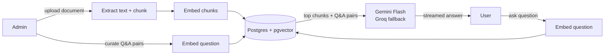

# Gaspy — RAG-based customer support assistant

Gaspy is a customer support chatbot built on retrieval-augmented generation (RAG). Users ask questions in a chat widget; the server embeds the question, retrieves the closest passages from a pgvector-backed knowledge base, and streams an answer generated from that context. Admins manage the knowledge base — document uploads, curated Q&A pairs, analytics — from a dashboard at `/admin`.

Built with Next.js 16 (App Router), TypeScript, PostgreSQL with the pgvector extension (Neon), Prisma, and Google Gemini. Detailed documentation: [ARCHITECTURE.md](ARCHITECTURE.md).

<!-- TODO: add screenshots (landing, chat widget, dashboard)
<p align="center">
  
  
</p>
-->

## Features

**Chat (public, no login required)**
- Streaming responses grounded in uploaded documents and curated Q&A pairs
- Relevance threshold: if nothing relevant is retrieved, the bot states that instead of generating an unsupported answer
- Provider fallback: Gemini primary, Groq backup with exponential-backoff retries
- Greeting detection handled without an LLM call

**Admin dashboard (`/admin`)**
- Document ingestion: PDF / DOCX / XLSX upload → text extraction → chunking → parallel embedding → pgvector storage
- Q&A pair management: each question is embedded and retrievable by semantic similarity
- Analytics: top questions, question volume over 12h / 7d / 30d ranges, unanswered-question tracking
- Google OAuth sign-in, dark mode, `Ctrl+K` command palette

## Architecture



At query time, the user's question is embedded and compared against all stored vectors using cosine distance. The top 5 document chunks and top 3 Q&A pairs are retrieved, filtered by a relevance threshold, and injected into the generation prompt. Responses stream to the client as `text/plain` over a `ReadableStream`.

Admin writes (uploads, Q&A edits) go through the same embedding pipeline so the knowledge base is queryable immediately after ingestion.

For pipeline diagrams, the data model, retrieval parameters, error handling, and the reasoning behind each design choice, see [ARCHITECTURE.md](ARCHITECTURE.md).

## Tech stack

| Layer | Choice |
|-------|--------|
| Framework | Next.js 16 (App Router), React 19 |
| Language | TypeScript 5.9 |
| Styling | Tailwind CSS 4, Framer Motion, Recharts, Lucide |
| Database | PostgreSQL 15 + pgvector (Neon) |
| ORM | Prisma 7 (Neon HTTP adapter) |
| AI | Gemini Flash (chat), gemini-embedding-001 (3072-dim), Groq (fallback) |
| Auth | Better Auth with Prisma adapter, Google OAuth |
| Validation | Zod |

## Project structure

```
src/
  app/
    (admin)/admin/        # Dashboard pages (overview, knowledge, qa, analytics, settings)
    (chat)/chat/          # Standalone chat page
    api/
      chat/               # RAG chat endpoint
      documents/          # Document list / upload / delete
      qa/                 # Q&A pair CRUD
      analytics/          # Dashboard analytics
      messages/           # Transcript export
      auth/[...all]/      # Better Auth handler
      health/
  components/
    admin/                # Dashboard UI
    chat/                 # Chat widget UI
    landing/              # Marketing page
    ui/                   # Shared primitives, command palette
  lib/
    embeddings.ts         # Embedding + pgvector similarity queries
    chunker.ts            # Fixed-size chunking (2000 chars, 200 overlap)
    parsers.ts            # PDF / DOCX / XLSX text extraction
    groq.ts               # OpenAI-compatible fallback client
    rate-limiter.ts       # In-memory limiter (60 RPM / 1500 day)
    auth.ts, auth-guard.ts
    admin-data.ts         # Dashboard queries
prisma/
  schema.prisma           # Document, Chunk, QAPair, QuestionLog, Message, auth tables
scripts/
  make-admin.ts           # Promote a user to the admin role
```

## Getting started

Requirements: Node 20+, a PostgreSQL 15+ database with the `pgvector` extension (Neon works out of the box).

```bash
# 1. Install dependencies
npm install

# 2. Configure environment
cp .env.example .env
# Fill in DATABASE_URL, GEMINI_API_KEY, BETTER_AUTH_SECRET,
# GOOGLE_CLIENT_ID, GOOGLE_CLIENT_SECRET

# 3. Apply migrations
npx prisma migrate deploy

# 4. Start the dev server
npm run dev
```

The chat widget is on the homepage (`/`) and at `/chat`. The dashboard is at `/admin`.

### Environment variables

| Variable | Purpose |
|----------|---------|
| `DATABASE_URL` | PostgreSQL connection string (Neon with pgvector) |
| `GEMINI_API_KEY` | Google AI Studio key (chat + embeddings) |
| `GEMINI_MODEL` | Optional; default `gemini-flash-latest` |
| `GROQ_API_KEY` / `GROQ_MODEL` | Optional fallback provider; default `qwen/qwen3.8-27b` |
| `BETTER_AUTH_SECRET` | Session cookie signing secret — `openssl rand -base64 32` (**required**) |
| `BETTER_AUTH_URL` | App base URL, e.g. `http://localhost:3000` |
| `GOOGLE_CLIENT_ID` / `GOOGLE_CLIENT_SECRET` | Google OAuth credentials for admin sign-in (**required**) |

All secrets are server-side only. `.env` is gitignored.

### Creating the first admin

1. Sign in once at `/admin/login` with a Google account (creates the `User` row).
2. Promote the account:

   ```bash
   npx tsx scripts/make-admin.ts your.email@gmail.com
   ```

## Authentication

- **Public:** landing page, chat widget, `POST /api/chat` (rate limited at 60 requests/min and 1,500/day, matching the Gemini free tier), `/api/health`
- **Protected:** `/admin` pages and all admin API routes — each verifies the Better Auth session server-side (`src/lib/auth-guard.ts`); unauthenticated requests receive a redirect or `401`

Sign-in uses Google OAuth. Sessions are stored in the database and referenced by an httpOnly signed cookie. See [ARCHITECTURE.md](ARCHITECTURE.md) for details and current limitations around role enforcement.

## Design notes

- **Single response format** — greetings, fallbacks, and LLM output all stream as `text/plain`, so the client has one parsing path
- **Fire-and-forget embeddings for Q&A** — rows are returned immediately; embeddings are generated in the background
- **Relevance gating** — retrieved context below a cosine-distance threshold of 0.6 triggers an explicit "no coverage" response instead of an LLM call, and is logged for the admin
- **Free-tier operation** — the in-memory rate limiter mirrors the Gemini quota (60 RPM / 1,500 requests/day) and runs before any processing

## Known limitations

Documented in [ARCHITECTURE.md](ARCHITECTURE.md#scope-and-future-work), the main ones being:

- Admin role enforcement is not active — any authenticated Google account currently has dashboard access
- Chat is single-turn: stored messages are not replayed into the prompt, so follow-up questions lack context
- The rate limiter is in-memory (per-instance, global bucket rather than per-IP)
- No automated tests or CI

## License

MIT
